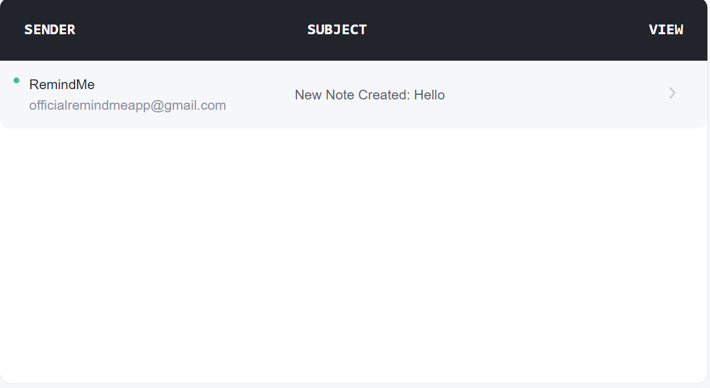
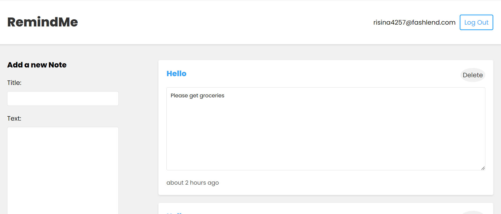

# RemindMe

About:
RemindMe is an MERN stack application that allows users to create text reminders (notes) to be sent directly to their email addresses twice - once immediately and again 24 hours later. Its application is simplistic but its core functionality is noteworthy, and it includes a variety of features ranging from: 

-Authentication protocols - secure user signup/login utilizing JSON Web Tokens along with hashed passwords via bcrypt 

-A variety of React hooks for a more impressive user experience

-RESTful APIs for handling note and user data transactions 

-Email and password validation 

-A MongoDB system in the backend for data modeling and database interactions

-NodeMailer for sending immediate and scheduled email notifications to users upon note creation

The application is composed of a frontend and a backend component. 
To initialize the frontend, change directory into it and type "npm install" into the terminal. Then, type "npm run dev" to start the backend on its port (4000).
To initialize the backend, change directory into it and type "npm install" into the terminal. Then, type "npm start" to start the frontend on its port (3000).

